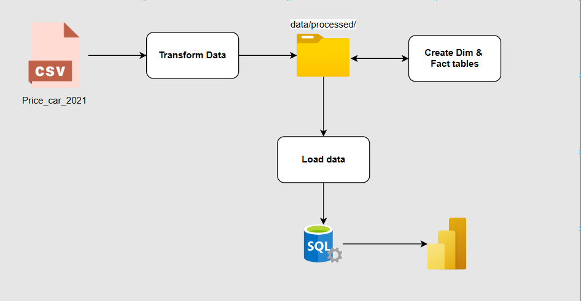

# 🚗 Project: Process, store, visualize Car Data

## 📌 Giới thiệu
Dự án này tập trung vào việc xử lý dữ liệu xe ô tô từ file CSV, lưu trữ vào SQL Server và trực quan hóa bằng Power BI. Quy trình bao gồm:
- Làm sạch và chuẩn hóa dữ liệu bắng **Pandas**.
- Tạo table  **Dim & Fact** theo mô hình Star schema.
- Load data vào **SQLServer** để lưu trữ.
- Xây dựng báo cáo và dashboard bằng **Power BI**.



## 🛠️ Công nghệ sử dụng
- **Python**: Xử lý dữ liệu với Pandas, kết nối SQL Server bằng pyodbc.
- **SQL Server**: Lưu trữ dữ liệu theo mô hình Star schema.
- **Power BI**: Trực quan hóa dữ liệu.

## 📂 Cấu trúc thư mục
```
📦 Pricecar2021
 ┣ 📂 database            # Chứa file tạo bảng, lưu dữ liệu vào SQL Server
 ┣ 📂 dataset             # Chứa file data thô và data đã qua xữ lý
 ┣ 📂 src                 # Chứa source code
 ┣ 📂 powerbi             # Chứa file báo cáo Power BI (.pbix)
 ┣ 📜 README.md           # Tài liệu hướng dẫn
```

## ⚙️ Hướng dẫn sử dụng
### Cài đặt môi trường
Cài đặt các thư viện Python cần thiết bằng lệnh:
```bash
pip install pandas pyodbc
```

### Chạy file xử lý dữ liệu
```bash
python 1_transform.ipynb
```

### Chạy file tạo Table **Dim & Fact**
```bash
python 2_create_table.ipynb
```

### Chạy file để insert data vào SQLserver 
```bash
python 3_load.ipynb
```

### Mở Power BI để xem báo cáo
- Mở file `powerbi/report.pbix` bằng Power BI Desktop.
- Xem các dashboard phân tích dữ liệu.


## 📞 Liên hệ
Nếu có thắc mắc, hãy liên hệ với mình qua [tanphatcoder@Gmail.com](mailto:tanphatcoder@Gmail.com).
